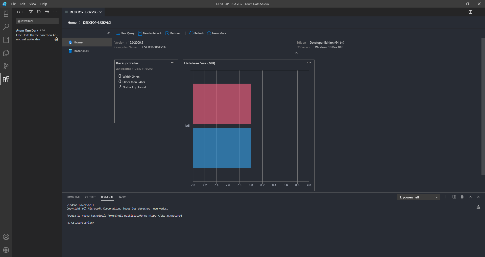
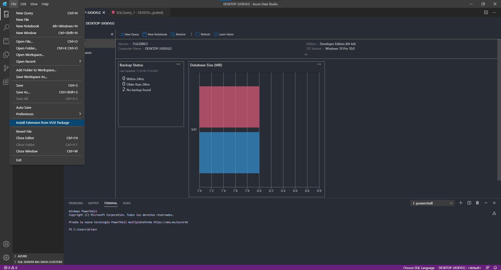

### Azure Data Studio

Azure Data Studio es una herramienta de base de datos multiplataforma para profesionales de datos que utilizan plataformas de datos locales y en la nube en Windows, macOS y Linux.

Azure Data Studio ofrece una experiencia de editor moderna con IntelliSense, fragmentos de código, integración de control de código fuente y una terminal integrada. Está diseñado pensando en el usuario de la plataforma de datos, con gráficos integrados de conjuntos de resultados de consultas y cuadros de mando personalizables. Para obtener más información sobre Azure Data Studio, visite

[Azure Data Studio](https://docs.microsoft.com/en-us/sql/azure-data-studio/download-azure-data-studio?view=sql-server-ver15)

<table align="center">
  <tr>
    <td align="center" style="padding=0;width=50%;">
      
    </td>
  </tr>
</table>

_Descargar Azure Data Studio Windows_

📦 Download and install Azure Data Studio [Azure Data Studio](https://docs.microsoft.com/en-us/sql/azure-data-studio/download-azure-data-studio?view=sql-server-ver15)

 _Pagina Principal_

<table align="center">
  <tr>
    <td align="center" style="padding=0;width=50%;">
      
    </td>
  </tr>
</table>

_Extenciones_

<table align="center">
  <tr>
    <td align="center" style="padding=0;width=50%;">
      
    </td>
  </tr>
</table>

