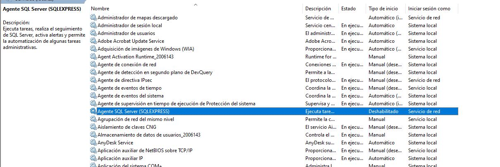
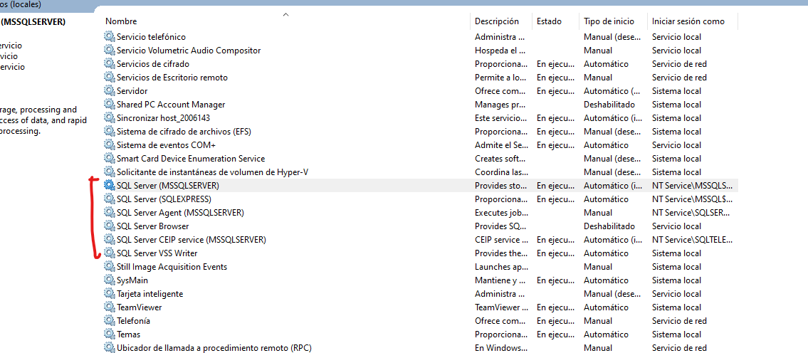
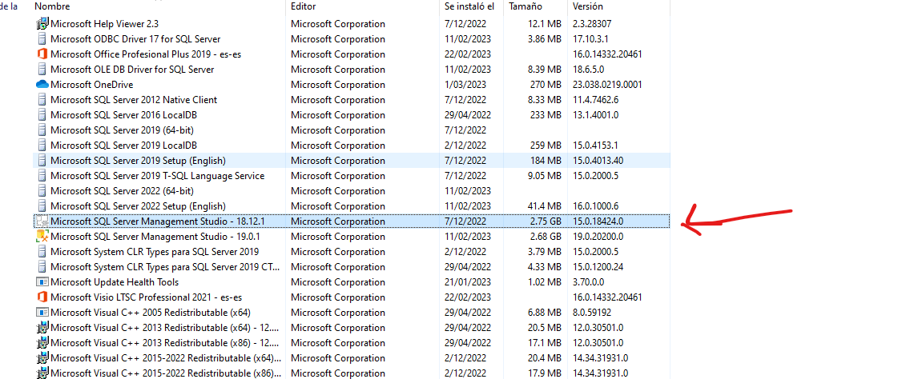
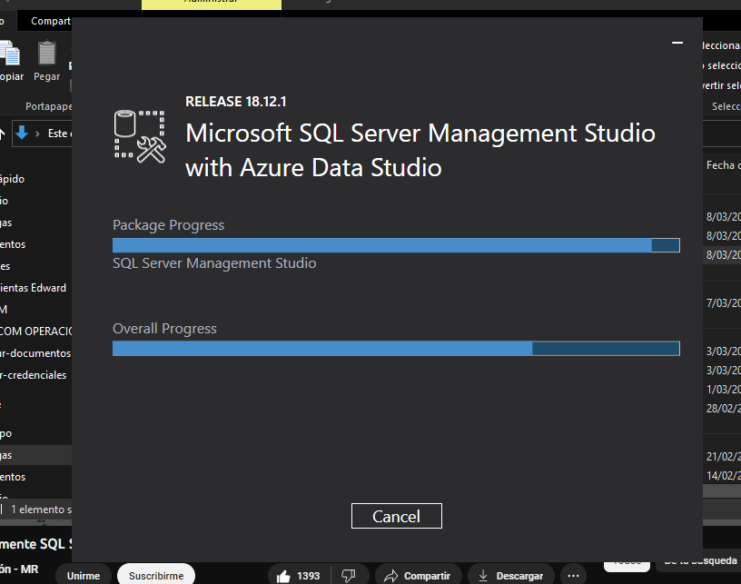

## Eliminar SQL SERVER 

Tutorial - [Cómo desinstalar correctamente SQL Server](https://www.youtube.com/watch?v=vFwkkK6TU9o)  

**Desactivar SQL**

CONTROL + R (Ejecutar)

```
services.msc
```

<table align="center">
  <tr>
    <td align="center" style="padding=0;width=50%;">
      
    </td>
  </tr>
</table>

<table align="center">
  <tr>
    <td align="center" style="padding=0;width=50%;">
      
    </td>
  </tr>
</table>


- Cambiar el proceso a manual
- Reiniciar

--

**Eliminar SQL**


* Abrir Panel de control

_Desinstalar SQL Management Studio_

<table align="center">
  <tr>
    <td align="center" style="padding=0;width=50%;">
      
    </td>
  </tr>

  <table align="center">
  <tr>
    <td align="center" style="padding=0;width=50%;">
      
    </td>
  </tr>


