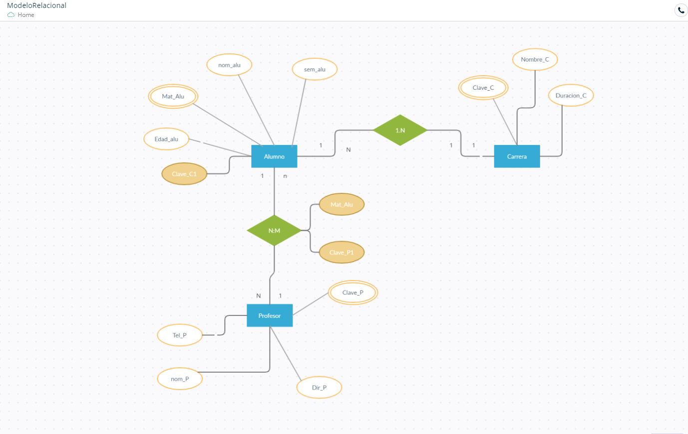

### Elementos del diagrama entiedad Relacion Extendido (ERR)

- Entidad: Objeto conreto o abstracto que gigura en nusta bd como : alumno, cliente, empresa, alergia

- Relacion: Relacion enter entidades, tambien llamdo mapeo, o cardinalidad

- Union entre entidades

- Atributo Caracteristicas de una entiedad como: nombre, edad, fecha

- Atributo principal o clave primaria

- Atrivuto principal o clave primaria

- Atributo foraneo o clave secundaria

<table align="center">
  <tr>
    <td align="center" style="padding=0;width=50%;">
      
    </td>
  </tr>
</table>

---

_Revisar las Reglas de Negocio_

Reglas del negocio

Se desea diseñar una Base de Datos para llevar un cierto control de los soldados que realizan el servicio militar. 

Los datos significativos a tener en cuenta son:

Un soldado se define por su código de soldado (único), su nombre, apellidos y su grado.
Existen varios cuarteles, cada uno se define por su código de cuartel, nombre y ubicación.
Hay Cuerpos del Ejército (Infantería, Artillería, Armada,…) y cada uno se define por un código de cuerpo y denominación.
Los soldados están agrupados en compañías, siendo significativa para cada una de éstas, el número de compañía y la actividad principal que realiza.
Los soldados realizan servicios (guardia, cuartelero,...) y se definen por el código de servicio y actividad.

Consideraciones de diseño:

Un soldado pertenece a un único cuerpo y a una única compañía, durante todo el servicio militar.
Pueden pertenecer soldados de diferentes cuerpos a una compañía, no habiendo relación directa entre compañías y cuerpos.
Una compañía puede estar ubicada en varios cuarteles, y en un cuartel puede haber varias compañías. Eso sí, un soldado sólo está en un cuartel.
Un soldado realiza varios servicios a lo largo del SM y un mismo servicio puede ser realizado por más de un soldado (con independencia de la compañía), siendo significativa la fecha de realización.

_Solucion_

<table align="center">
  <tr>
    <td align="center" style="padding=0;width=50%;">
      
    </td>
  </tr>
</table>