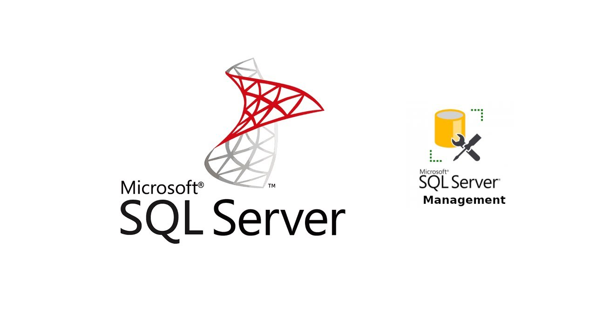
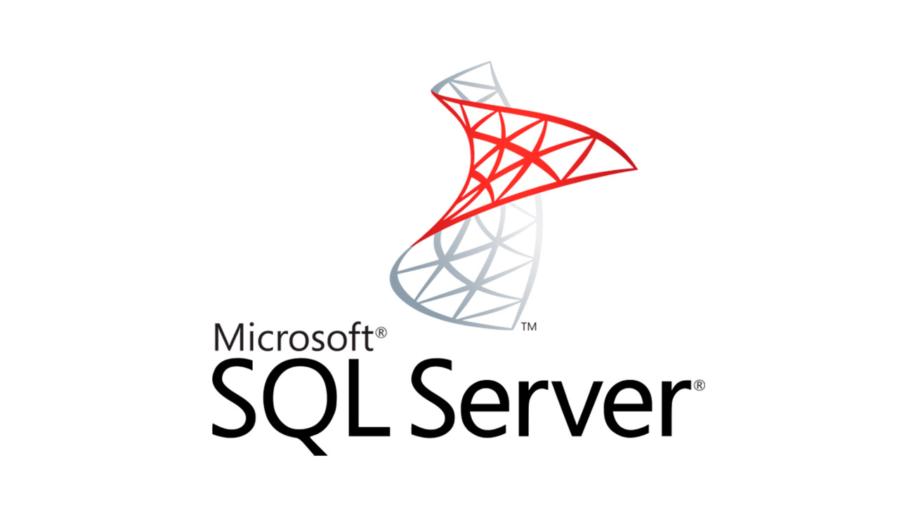
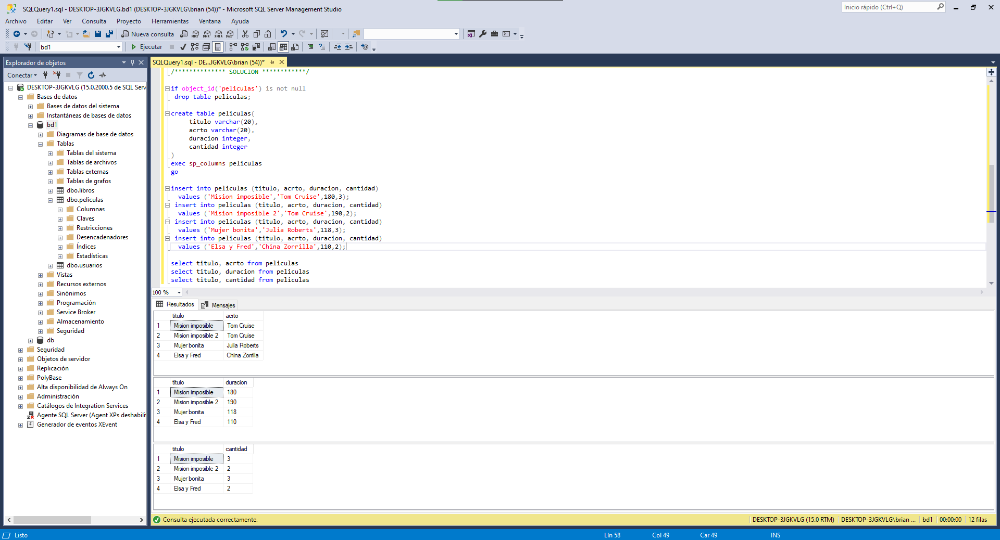
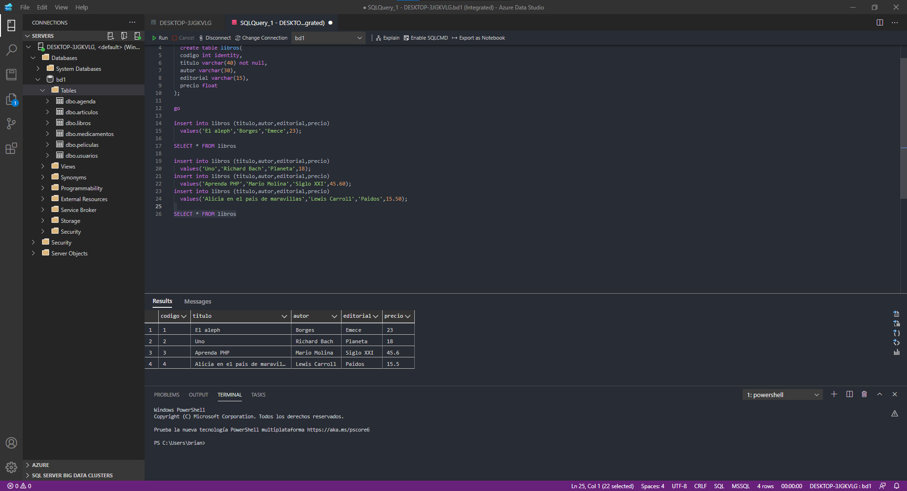

<h2 align="center">Learning-Micosoft-SQL-SERVER </h2>

<p align="center">
  
   </a>
    
  </a>
  <a href="https://github.com/BrianMarquez3/Learning-Microsoft-SQL-SERVER/stargazers">
    
  </a>
  <a href="https://github.com/BrianMarquez3/Learning-Microsoft-SQL-SERVER/network">
    
  </a>
    
  </a>
  
  </a>
    
  </a>
  
  </a>
    
  </a>
  
   </a>
   <a href="https://github.com/BrianMarquez3/Learning-Microsoft-SQL-SERVER/network">
    
  </a><br>
 
  
  
  
</p>
  
<!--  -->
<table align="center">
  <tr>
    <td align="center" style="padding=0;width=50%;">
      
    </td>
  </tr>
</table>


## Tabla de Contenidos

| Numeration   | Check  |Topic          | Quantization     |    Edit Gitpot    |    Downloads    |  link   |
| ------------ |--------|-------------- |----------------- |------------------ |---------------- |-------- |
|  001   |:heavy_check_mark: | [Crear Base de Datos](#Crear-Base-de-Datos)   |        | - | - | [ ⬅️ Atras](https://github.com/BrianMarquez3) | 
|  002   |:heavy_check_mark: | [Insertar Datos](#Insertar-Datos)  |         | - | - | [ ⬅️ Atras](https://github.com/BrianMarquez3) | 
|  003  |:heavy_check_mark: | [Tipos Datos Básicos](#Tipos-Datos-Básicos)  |  :hourglass:     | - | - | [ ⬅️ Atras](https://github.com/BrianMarquez3) | 
|  004  |:heavy_check_mark: | [SELECT](#SELECT)  |  :hourglass:     | - | - | [ ⬅️ Atras](https://github.com/BrianMarquez3) |
|  005  |:heavy_check_mark: | [Recuperar Campos select](#Recuperar-Campos-select)  |  :hourglass:     | - | - | [ ⬅️ Atras](https://github.com/BrianMarquez3) |
|  006  |:heavy_check_mark: | [Recuperar algunos registros WHERE](#Recuperar-algunos-registros-WHERE)  |  :hourglass:     | - | - | [ ⬅️ Atras](https://github.com/BrianMarquez3) |
|  007  |:heavy_check_mark: | [Recuperar algunos registros WHERE EJERCICIO](#Recuperar-algunos-registros-WHERE-EJERCICIO)  |  :hourglass:     | - | - | [ ⬅️ Atras](https://github.com/BrianMarquez3) |
|  008  |:heavy_check_mark: | [Operadores relacionales](#Operadores-relacionales)  |  :hourglass:     | - | - | [ ⬅️ Atras](https://github.com/BrianMarquez3) |
|  009  |:heavy_check_mark: | [Operadores-Relacional](#Operadores-Relacional)  |  :hourglass:     | - | - | [ ⬅️ Atras](https://github.com/BrianMarquez3) |
|  010  |:heavy_check_mark: | [Operadores Relacional Ejercicio](#Operadores-Relacional-Ejercicio)  |  :hourglass:     | - | - | [ ⬅️ Atras](https://github.com/BrianMarquez3) |
|  011  |:heavy_check_mark: | [Borrar registros](#Borrar-egistros)  |  :hourglass:     | - | - | [ ⬅️ Atras](https://github.com/BrianMarquez3) |
|  012  |:heavy_check_mark: | [Actualizar Registros](#Actualizar-Registros)  |  :hourglass:     | - | - | [ ⬅️ Atras](https://github.com/BrianMarquez3) |
|  013  |:heavy_check_mark: | [Comentarios](#Comentarios)  |  :hourglass:     | - | - | [ ⬅️ Atras](https://github.com/BrianMarquez3) |
|  014  |:heavy_check_mark: | [Null](#Null)  |  :hourglass:     | - | - | [ ⬅️ Atras](https://github.com/BrianMarquez3) |
|  015  |:heavy_check_mark: | [Clave Primaria](#Clave-Primaria)  |  :hourglass:     | - | - | [ ⬅️ Atras](https://github.com/BrianMarquez3) |
|  016  |:heavy_check_mark: | [Campo con atributo identy](#Campo-con-atributo-identy)  |  :hourglass:     | - | - | [ ⬅️ Atras](https://github.com/BrianMarquez3) |
|  017  |:heavy_check_mark: | [Caracteristicas del atributo identy](#Caracteristicas-del-atributo-identy)  |  :hourglass:     | - | - | [ ⬅️ Atras](https://github.com/BrianMarquez3) |
|  018  |:heavy_check_mark: | [Truncate table](#Truncate-table)  |  :hourglass:     | - | - | [ ⬅️ Atras](https://github.com/BrianMarquez3) |


## Azure

| Numeration   | Check  |Topic          | Quantization     |    Edit Gitpot    |    Downloads    |  link   |
| ------------ |--------|-------------- |----------------- |------------------ |---------------- |-------- |
|  A1   | | [Azure Data Studio](#Azure-Data-Studio)   |   :hourglass:     | - | - | [ ⬅️ Atras](https://github.com/BrianMarquez3) |


## Crear Base de Datos

```tsql

if object_id('usuario') is not null
	drop table usuario;

create table usuario(
	usuarios varchar(30),
	clave varchar(10)
);

/*Procediemtnos Almacenados*/

```tsql
exec sp_columns usuario;
exec sp_tables @table_owner='dbo'
```


|Number   | File       |    Link     |    Code     | version     | Estate     | Behind        |
|:-------:|:-------------:|:-----------:|:-----------:|:-----------:|:-----------:|:-----------:|
|001      | [Crear Base de Datos](https://github.com/BrianMarquez3/Learning-Microsoft-SQL-SERVER/tree/main/001%20crear%20Base%20de%20Datos)          |      ✔️     |  yes | yes | ✔️ | [⬅️Atras](#Tabla-de-contenidos) |


## Insertar Datos


|Number   | File       |    Link     |    Code     | version     | Estate     | Behind        |
|:-------:|:-------------:|:-----------:|:-----------:|:-----------:|:-----------:|:-----------:|
|002      | [Insertar Datos](https://github.com/BrianMarquez3/Learning-Microsoft-SQL-SERVER/tree/main/002%20InsertarDatos)            |      ✔️     |  yes | yes | ✔️ | [⬅️Atras](#Tabla-de-contenidos) |

## Tipos Datos Básicos

|Number   | File       |    Link     |    Code     | version     | Estate     | Behind        |
|:-------:|:-------------:|:-----------:|:-----------:|:-----------:|:-----------:|:-----------:|
|003      | [Tipos Datos Básicos](https://github.com/BrianMarquez3/Learning-Microsoft-SQL-SERVER/tree/main/003%20TiposDatosB%C3%A1sicos)           |      ✔️     |  yes | yes | ✔️ | [⬅️Atras](#Tabla-de-contenidos) |

## SELECT

### La sintaxis básica y general es la siguiente:

```tsql
 select * from NOMBRETABLA;
El asterisco (*) indica que se seleccionan todos los campos de la tabla.
```

Podemos especificar el nombre de los campos que queremos ver separándolos por comas:

```tsql
 select titulo,autor from libros; 
 ```

La lista de campos luego del "select" selecciona los datos correspondientes a los campos nombrados. En el ejemplo anterior seleccionamos los campos "titulo" y "autor" de la tabla "libros", mostrando todos los registros. Los datos aparecen ordenados según la lista de selección, en dicha lista los nombres de los campos se separan con comas.

### Comando "go" del "SQL Server Management Studio"
Cuando tenemos un lote de comandos SQL y necesitamos particionarlo en distintos sublotes debemos utilizar el comando "go", no es un comando SQL sino un comando propio del "SQL Server Management Studio":git 


|Number   | File       |    Link     |    Code     | version     | Estate     | Behind        |
|:-------:|:-------------:|:-----------:|:-----------:|:-----------:|:-----------:|:-----------:|
|004      | [SELECT](https://github.com/BrianMarquez3/Learning-Microsoft-SQL-SERVER/tree/main/004%20Recuperar%20algunos%20campos%20(select))           |      ✔️     |  yes | yes | ✔️ | [⬅️Atras](#Tabla-de-contenidos) |

## Recuperar Campos select

La sintaxis básica y general es la siguiente:

```sql
select * from NOMBRETABLA;
```

El asterisco (*) indica que se seleccionan todos los campos de la tabla.

Podemos especificar el nombre de los campos que queremos ver separándolos por comas:

```sql
 select titulo,autor from libros; 
```

La lista de campos luego del "select" selecciona los datos correspondientes a los campos nombrados. En el ejemplo anterior seleccionamos los campos "titulo" y "autor" de la tabla "libros", mostrando todos los registros. Los datos aparecen ordenados según la lista de selección, en dicha lista los nombres de los campos se separan con comas.



|Number   | File       |    Link     |    Code     | version     | Estate     | Behind        |
|:-------:|:-------------:|:-----------:|:-----------:|:-----------:|:-----------:|:-----------:|
|005      |  [Recuperar Campos select](https://github.com/BrianMarquez3/Learning-Microsoft-SQL-SERVER/tree/main/005%20recuperarCampos(SELECT))            |      ✔️     |  yes | yes | ✔️ | [⬅️Atras](#Tabla-de-contenidos) |

## Recuperar algunos registros WHERE


|Number   | File       |    Link     |    Code     | version     | Estate     | Behind        |
|:-------:|:-------------:|:-----------:|:-----------:|:-----------:|:-----------:|:-----------:|
|006      |  [Recuperar algunos registros WHERE](https://github.com/BrianMarquez3/Learning-Microsoft-SQL-SERVER/tree/main/006%20Recuperar%20algunos%20registros%20WHERE)             |      ✔️     |  yes | yes | ✔️ | [⬅️Atras](#Tabla-de-contenidos) |


## Recuperar algunos registros WHERE EJERCICIO

|Number   | File       |    Link     |    Code     | version     | Estate     | Behind        |
|:-------:|:-------------:|:-----------:|:-----------:|:-----------:|:-----------:|:-----------:|
|007      |  [Recuperar algunos registros WHERE](https://github.com/BrianMarquez3/Learning-Microsoft-SQL-SERVER/tree/main/007%20Recuperar%20algunos%20registros%20EJERCICIO)             |      ✔️     |  yes | yes | ✔️ | [⬅️Atras](#Tabla-de-contenidos) |


## Operadores relacionales

Los operadores son símbolos que permiten realizar operaciones matemáticas, concatenar cadenas, hacer comparaciones.

SQL Server tiene 4 tipos de operadores:

1. relacionales (o de comparación)
2. aritméticos
3. 4. de concatenación
lógicos.
Por ahora veremos solamente los primeros.

Los operadores relacionales (o de comparación) nos permiten comparar dos expresiones, que pueden ser variables, valores de campos, etc.

Hemos aprendido a especificar condiciones de igualdad para seleccionar registros de una tabla; por ejemplo:

```sql
 select * from libros
  where autor='Borges';
```
Utilizamos el operador relacional de igualdad.

Los operadores relacionales vinculan un campo con un valor para que SQL Server compare cada registro (el campo especificado) con el valor dado.

Los operadores relacionales son los siguientes:

=	igual <br>
<>	distinto <br>
>	mayor <br>
<	menor <br>
>=	mayor o igual <br>
<=	menor o igual<br>

Podemos seleccionar los registros cuyo autor sea diferente de "Borges", para ello usamos la condición:

```sql
 select * from libros
  where autor<>'Borges';
```

Podemos comparar valores numéricos. Por ejemplo, queremos mostrar los títulos y precios de los libros cuyo precio sea mayor a 20 pesos:

```sql
 select titulo, precio
  from libros
  where precio>20;
```

Queremos seleccionar los libros cuyo precio sea menor o igual a 30:

```sql
 select *from libros
  where precio<=30;
```
Los operadores relacionales comparan valores del mismo tipo. Se emplean para comprobar si un campo cumple con una condición.

No son los únicos, existen otros que veremos mas adelante.

|Number   | File       |    Link     |    Code     | version     | Estate     | Behind        |
|:-------:|:-------------:|:-----------:|:-----------:|:-----------:|:-----------:|:-----------:|
|008      |   [Operadores relacionales](https://github.com/BrianMarquez3/Learning-Microsoft-SQL-SERVER/tree/main/008%20Operadores%20relacionales)             |      ✔️     |  yes | yes | ✔️ | [⬅️Atras](#Tabla-de-contenidos) |

## Operadores Relacional Ejercicio

|Number   | File       |    Link     |    Code        | version     | Estate     | Behind       |
|:-------:|:-------------:|:-----------:|:-----------:|:-----------:|:-----------:|:-----------:|
|009      |    [Operadores Relacional Ejercicio](https://github.com/BrianMarquez3/Learning-Microsoft-SQL-SERVER/tree/main/009%20Operadores%20Relacional%20-%20Ejercicio)             |      ✔️     |  yes | yes | ✔️ | [⬅️Atras](#Tabla-de-contenidos) |

## Borrar registro

|Number   | File       |    Link     |    Code        | version     | Estate     | Behind       |
|:-------:|:-------------:|:-----------:|:-----------:|:-----------:|:-----------:|:-----------:|
|010      |   [Borrar registro - Delete](https://github.com/BrianMarquez3/Learning-Microsoft-SQL-SERVER/tree/main/010%20Borrar%20registros%20(delete))             |      ✔️     |  yes | yes | ✔️ | [⬅️Atras](#Tabla-de-contenidos) |

## Actualizar Registros

|Number   | File       |    Link     |    Code        | version     | Estate     | Behind       |
|:-------:|:-------------:|:-----------:|:-----------:|:-----------:|:-----------:|:-----------:|
|011      |    [Actualizar Registros - Update](https://github.com/BrianMarquez3/Learning-Microsoft-SQL-SERVER/tree/main/011%20Actualizar%20Registros%20(update))                |      ✔️     |  yes | yes | ✔️ | [⬅️Atras](#Tabla-de-contenidos) |
|012      |    [Actualizar Registros - Update Ejercicio](https://github.com/BrianMarquez3/Learning-Microsoft-SQL-SERVER/tree/main/012%20Actualizar%20Registros%20(update)%20Ejercicio)                |      ✔️     |  yes | yes | ✔️ | [⬅️Atras](#Tabla-de-contenidos) |

## Comentarios

|Number   | File       |    Link     |    Code        | version     | Estate     | Behind       |
|:-------:|:-------------:|:-----------:|:-----------:|:-----------:|:-----------:|:-----------:|
|013      |    [Actualizar Registros - ](hhttps://github.com/BrianMarquez3/Learning-Microsoft-SQL-SERVER/tree/main/013%20Comentarios)                 |      ✔️     |  yes | yes | ✔️ | [⬅️Atras](#Tabla-de-contenidos) |

## Null

|Number   | File       |    Link     |    Code        | version     | Estate     | Behind       |
|:-------:|:-------------:|:-----------:|:-----------:|:-----------:|:-----------:|:-----------:|
|014      |   [Null](https://github.com/BrianMarquez3/Learning-Microsoft-SQL-SERVER/tree/main/014%20Null)                 |      ✔️     |  yes | yes | ✔️ | [⬅️Atras](#Tabla-de-contenidos) |

## Clave Primaria

|Number   | File       |    Link     |    Code        | version     | Estate     | Behind       |
|:-------:|:-------------:|:-----------:|:-----------:|:-----------:|:-----------:|:-----------:|
|015      |   [Clave Primaria](https://github.com/BrianMarquez3/Learning-Microsoft-SQL-SERVER/tree/main/015%20Clave%20Primaria)               |      ✔️     |  yes | yes | ✔️ | [⬅️Atras](#Tabla-de-contenidos) |

## Campo con atributo identy

<table align="center">
  <tr>
    <td align="center" style="padding=0;width=50%;">
      
    </td>
  </tr>
</table>

|Number   | File       |    Link     |    Code        | version     | Estate     | Behind       |
|:-------:|:-------------:|:-----------:|:-----------:|:-----------:|:-----------:|:-----------:|
|016      |  [Campo con atributo identy](https://github.com/BrianMarquez3/Learning-Microsoft-SQL-SERVER/tree/main/016%20Campo%20con%20atributo%20identy)              |      ✔️     |  yes | yes | ✔️ | [⬅️Atras](#Tabla-de-contenidos) |

##  Caracteristicas del atributo identy

_Para saber cuál es el valor de inicio del campo "identity"_

```sql
select ident_seed('libros');
```
_Para permitir ingresar un valor en un campo de identidad activamos la opción_

```sql
set identity_insert libros on;
```

```sql
set identity_insert libros off;
```

|Number   | File          |    Link     |    Code     | version     | Estate     | Behind       |
|:-------:|:-------------:|:-----------:|:-----------:|:-----------:|:-----------:|:-----------:|
|017      |   [Caracteristicas del atributo identy](https://github.com/BrianMarquez3/Learning-Microsoft-SQL-SERVER/tree/main/016%20Campo%20con%20atributo%20identy)     |      ✔️     |  yes | yes | ✔️ | [⬅️Atras](#Tabla-de-contenidos) |

##  Truncate table


|Number   | File          |    Link     |    Code     | version     | Estate     | Behind       |
|:-------:|:-------------:|:-----------:|:-----------:|:-----------:|:-----------:|:-----------:|
|018      |   [Truncate table](https://github.com/BrianMarquez3/Learning-Microsoft-SQL-SERVER/tree/main/018%20Truncate%20table)     |      ✔️     |  yes | yes | ✔️ | [⬅️Atras](#Tabla-de-contenidos) |

---

<table align="center">
  <tr>
    <td align="center" style="padding=0;width=50%;">
      
    </td>
  </tr>
</table>

## Azure Data Studio

|Number   | File          |    Link     |    Code     | version     | Estate     | Behind       |
|:-------:|:-------------:|:-----------:|:-----------:|:-----------:|:-----------:|:-----------:|
|A        |    [Azure Data Studio](https://github.com/BrianMarquez3/Learning-Microsoft-SQL-SERVER/tree/main/Azure%20Data%20Studio)     |      ✔️     |  yes | yes | ✔️ | [⬅️Atras](#Tabla-de-contenidos) |

---
## Material Creador

Este sitio para el aprendizaje de la programación de computadoras es un proyecto de Diego Moisset <br> 

<table align="center">
 <tr>
      <td colspan="2" align="center">Material Creador</td>
  </tr>
  <tr>
      <td> SQL SERVER YA </td>
      <td> <a href="https://www.tutorialesprogramacionya.com/sqlserverya/"> SQL Server Ya </a></td>
  </tr>
</table>

## Spotify SQL SERVER

🎵 Music SQL SERVER [List on Spotify 🎤](https://open.spotify.com/playlist/1McRBCzJzhsa7FQ12qfbsR?si=HgVrOallSAyGWk6G6la7dQ)

## Paypal Donation

🩸 Hacer una donación [PAYPAL](https://www.paypal.com/donate?hosted_button_id=98U3T62494H9Y) 🍵

## License 

Todo acerca de la licencia [here](https://github.com/BrianMarquez3/Learning-Java/blob/main/LICENCE)

 <table align="center">
    <tr>
      <td colspan="3">A</td>
        <td>B</td>
      </tr>
      <tr>
        <td>C</td>
      <td colspan="2"></td>
        <td>E</td>
      </tr>
      <tr>
      <td colspan="3">F</td>
        <td>G</td>
    </tr>
</table>